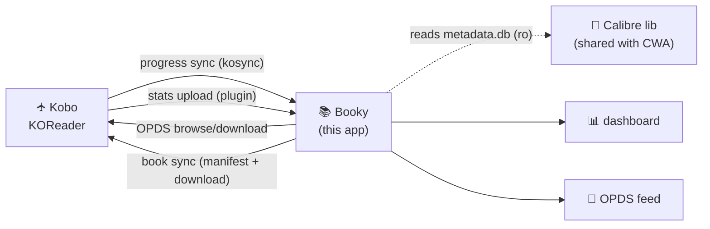

# 📚 Booky

A self-hosted companion for **KOReader** (on your Kobo) + **Calibre-Web-Automated**.
One small Go binary that does four things your current setup can't:

1. **Private reading-progress sync** — a drop-in replacement for KOReader's
   `kosync` server. Your reading position syncs across devices, on your own
   hardware, never touching `sync.koreader.rocks`.
2. **Bulk library book sync** — mirror your entire Calibre library onto the
   Kobo over WiFi. Deduped by content fingerprint (partial-MD5), so books
   already on the device under any name or folder aren't re-downloaded. This
   is the KOReader equivalent of Calibre-Web-Automated's Kobo Sync — which
   only targets the stock Nickel reader, not KOReader.
3. **A reading-stats dashboard** — ingests KOReader's `statistics.sqlite3` and
   turns it into a beautiful dashboard: total time, streaks 🔥, a GitHub-style
   year heatmap, reading speed, when-you-read patterns, per-book progress, and
   recent sessions. Books are matched to your Calibre library (covers, authors,
   series) automatically.
4. **A curated OPDS feed** — build collections like *On Deck* / *Want to Read*
   in the web UI; browse and pull them straight onto your Kobo from KOReader.

Everything is joined on KOReader's **partial-MD5 book fingerprint**, so a book's
sync position, its stats, and its Calibre entry all line up — even though none of
those three systems share an ID.



## Quick start (Docker)

```yaml
# docker-compose.yml — see deploy/docker-compose.yml for the full version
services:
  booky:
    image: ghcr.io/justinmdickey/booky:latest   # or `build: .` to build from source
    ports: ["8222:8222"]
    environment:
      BOOKY_PUBLIC_URL: "http://your-server-ip:8222"
      BOOKY_CALIBRE_LIBRARY: "/calibre-library"
      BOOKY_AUTH_USER: "reader"
      BOOKY_AUTH_PASS: "change-me"
    volumes:
      - booky-data:/data
      - /path/to/calibre-library:/calibre-library:ro   # same dir CWA uses
volumes:
  booky-data:
```

```sh
docker compose up -d           # pulls the published image; no source checkout needed
# open http://your-server-ip:8222
```

An amd64 image is published to `ghcr.io/justinmdickey/booky` by CI on every
push to `main` and on `v*` tags.

> Mount the Calibre library **read-only**. Booky only ever reads `metadata.db`,
> covers, and book files — it never writes to your library.

### Run without Docker

```sh
go build -o booky ./cmd/booky
BOOKY_CALIBRE_LIBRARY=/path/to/calibre-library ./booky
```

## Configuration

| Env var | Default | Meaning |
| --- | --- | --- |
| `BOOKY_ADDR` | `:8222` | Listen address |
| `BOOKY_DATA_DIR` | `./data` (`/data` in Docker) | Booky's own SQLite DB + uploads |
| `BOOKY_CALIBRE_LIBRARY` | *(empty)* | Calibre library dir (contains `metadata.db`). Empty disables library + OPDS |
| `BOOKY_AUTH_USER` / `BOOKY_AUTH_PASS` | *(empty)* | HTTP Basic auth for the OPDS feed, dashboard API, and stats upload. Empty = open |
| `BOOKY_ALLOW_REGISTRATION` | `true` | Allow new kosync users via `POST /users/create`. Set `false` after creating yours |
| `BOOKY_PUBLIC_URL` | *(derived)* | External base URL used in OPDS links |

## Connect your Kobo

### 1. Progress sync (kosync)
KOReader → top menu → **Tools (⚙) → Progress sync → Custom sync server**:

- **Custom sync server**: `http://your-server-ip:8222`
  — note the URL is the **bare root**, with *no* `/koreader` (or any other) path
  suffix. Many KOReader sync guides assume a suffix; Booky serves the kosync
  endpoints (`/users/create`, `/syncs/progress`, …) directly at the root, so
  don't append anything.
- **Register / Login**: pick a username + password (registration is on by default;
  turn it off afterward with `BOOKY_ALLOW_REGISTRATION=false`).

Your reading position now syncs to Booky instead of the public server.

### 2. Stats sync (companion plugin)
Copy `plugin/booky.koplugin/` to your Kobo at
`.adds/koreader/plugins/booky.koplugin/`, restart KOReader, then:

KOReader → **Tools (⚙) → Booky stats sync**:
- **Set server URL** → `http://your-server-ip:8222`
- **Set username / password** → match `BOOKY_AUTH_USER` / `BOOKY_AUTH_PASS`
- Leave **Auto-upload on close/suspend** on.

Your `statistics.sqlite3` uploads over WiFi (throttled to ~every 30 min) and the
dashboard lights up. You can also push it any time with **Upload stats now**.

No plugin? Upload manually:
```sh
curl -u reader:change-me -F file=@statistics.sqlite3 \
  http://your-server-ip:8222/api/stats/upload
```

### 3. Bulk book sync (the whole library → Kobo)
The same plugin can mirror your entire Calibre library onto the device — built
for an all-KOReader Kobo where CWA's Kobo Sync (which targets the stock Nickel
reader) isn't an option.

KOReader → **Tools (⚙) → Booky stats sync**:
- **Set download folder** → where books land (default `…/Booky`).
- **Organize into author folders** (on by default) → saves books as
  `<Author>/<Title>.epub` so the device mirrors your library; turn off to keep
  everything flat in one folder.
- **Sync all books now** → downloads every book in the library, skipping ones
  you already have. Dedup is by **content fingerprint** (the partial-MD5), so a
  book already on the device is recognised no matter its filename or which
  subfolder it's in — point the download folder at an existing author-foldered
  library and it won't make flat duplicates, and toggling the folder layout
  never re-downloads books you already have. Progress shows `downloading 12/52`;
  you can dismiss to stop.
- **Auto-sync books on WiFi connect** → hands-off; pulls new books whenever the
  Kobo joins WiFi (throttled to ~every 30 min).

Under the hood the plugin reads `GET /api/sync/manifest` (the full library with
download URLs) and pulls files via Booky's `/opds/download/...`. Note this is a
*download* of files into a folder KOReader reads — it does not push to a sleeping
device (no e-reader supports that for KOReader); "sync" here means the device
fetches everything it's missing on demand or on WiFi connect.

### 4. Curated OPDS feed
In the Booky web UI → **Curate** → create a collection, add books from your
library. Then on the Kobo: KOReader → **OPDS catalog → + (add)**:

- **URL**: `http://your-server-ip:8222/opds`
- **Username / Password**: your `BOOKY_AUTH_*` (if set)

Browse *On Deck → your collection* and download straight to the device.

## How the join works

KOReader fingerprints each book with a *partial MD5* — twelve 1 KiB samples at
offsets `1024 × 4ⁱ`. This same hash is:

- the **kosync `document` id** (binary mode, the default),
- the **`md5` column** in `statistics.sqlite3`, and
- recomputable by Booky from the **Calibre file on disk**.

So Booky ties all three together without any shared database id. (Implemented in
`internal/koreader/partialmd5.go`, verified against the KOReader algorithm in
`partialmd5_test.go`.)

## API surface

| Endpoint | Purpose |
| --- | --- |
| `POST /users/create`, `GET /users/auth`, `PUT /syncs/progress`, `GET /syncs/progress/{doc}` | kosync protocol (KOReader-compatible) |
| `POST /api/stats/upload` | Upload `statistics.sqlite3` (raw body or multipart `file`) |
| `GET /api/sync/manifest` | Full library list (download URLs + filenames) for bulk book sync |
| `GET /api/summary` | Dashboard JSON |
| `GET /api/library`, `GET /api/collections`, `POST/DELETE /api/collections...` | Curation |
| `GET /opds`, `/opds/all`, `/opds/recent`, `/opds/collection/{id}`, `/opds/download/{id}/{fmt}`, `/opds/cover/{id}` | OPDS catalog |
| `GET /` | Web dashboard |

## Development

```sh
go test ./...      # unit + integration tests (partial-MD5, kosync, ingest)
go run ./cmd/booky
```

## License

MIT.
